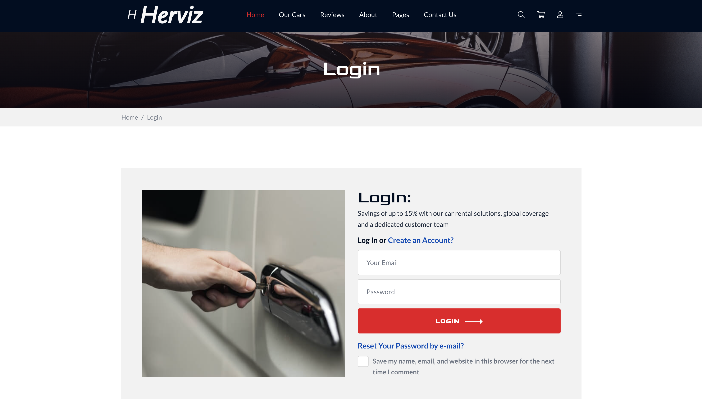
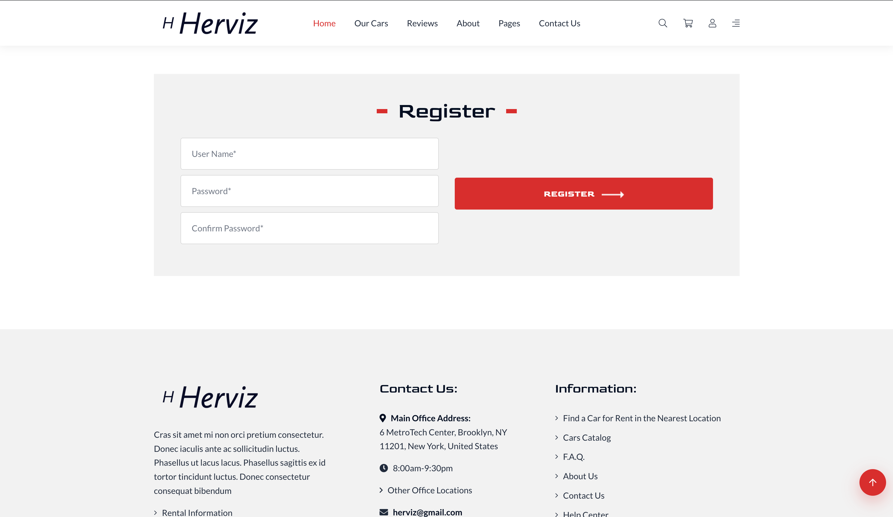
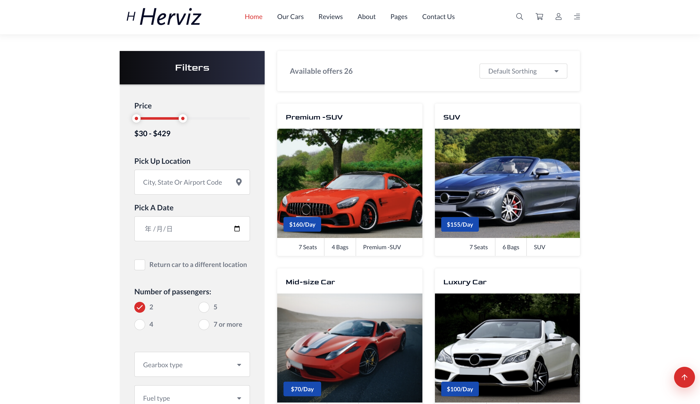
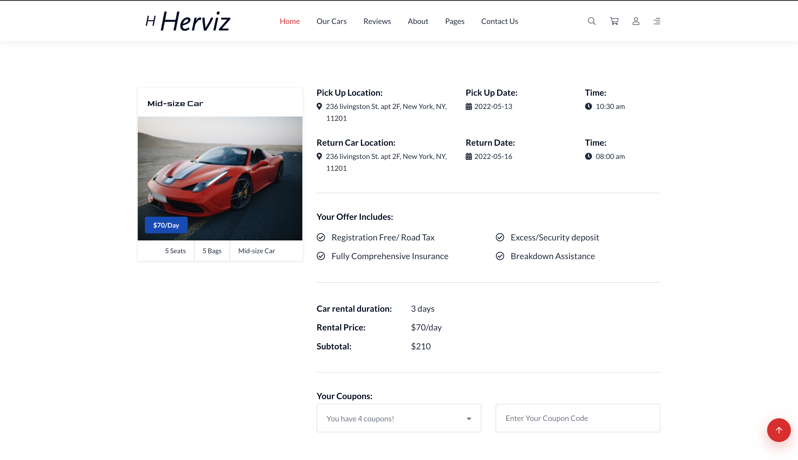
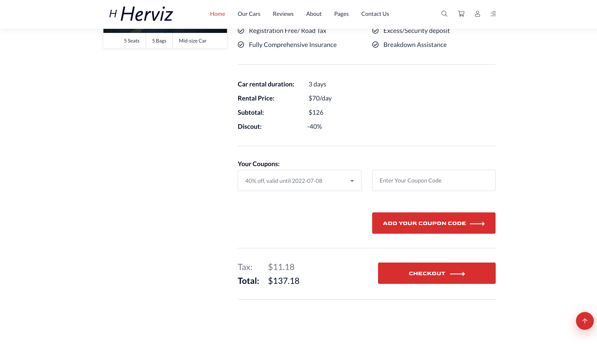
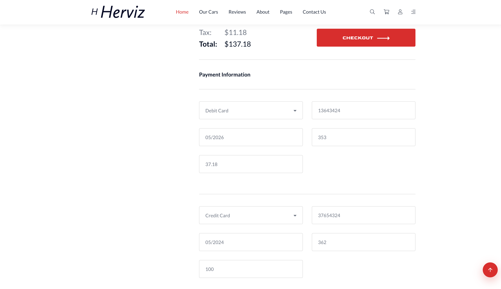
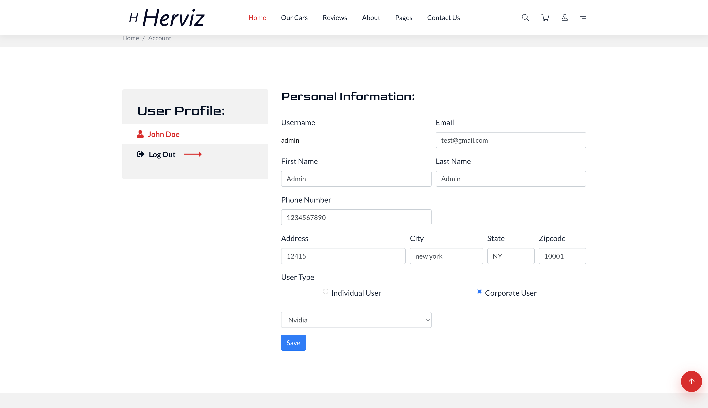

# Herviz
Herviz is a North American car rental website that provides car rental services, order management services, and user center services

[中文](https://github.com/DB-CarRet/Herviz) | **English**

## Technology Stack

|  Module  |         Framework         |
| :------: | :-----------------------: |
| FrontEnd |         Bootstrap         |
| BackEnd  | Springboot + Mybatis plus |
| Security |         Sa-token          |
|  Cache   |           Redis           |
| Database |           Mysql           |

## Function Overview

### HomePage

Showcase Herviz's popular services, popular rental car models

### Authentication

User login, registration and password reset

### Search Car

Search for rental vehicles by rental time and location

### Select Vehicle Brand

According to the filter search results, select the vehicle brand you want to rent, and the system will automatically assign the vehicle

### Order Detail

Display order information, including time and place, vehicle information, price information, etc.

### Use Coupon

User can add and use coupon

### Checkout

Users can enter payment information to settle the order, and the order can be divided into multiple payments

### User Profile

can update user information

